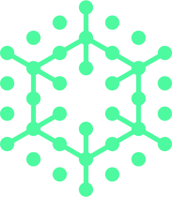

# Correlate

**AI-powered schema correlation and document translation tool for knowledge organization**



Correlate is a powerful desktop application that uses AI to intelligently correlate different knowledge management schemas and translate documents between them. Whether you're migrating from Notion to Obsidian, standardizing team documentation, or bridging different organizational systems, Correlate makes schema translation seamless and intelligent.

## ✨ Features

### 🧠 **AI-Powered Schema Correlation**
- **LLM-driven Analysis**: Uses Ollama (local) and Gemini (fallback) to intelligently map schema fields
- **Confidence-based Processing**: Separates high-confidence mappings from uncertain ones
- **Interactive Review**: Manual approval system for translation samples before processing

### 📚 **Advanced Document Processing**
- **Batch Translation**: Process entire document libraries with preserved metadata
- **Fallback Tag Preservation**: Low-confidence and unmapped fields preserved as searchable tags
- **Multiple Format Support**: JSON schemas (Notion-style) and YAML schemas (Obsidian-style)

### 🔍 **Vector Store & Auto-Linking**
- **Semantic Document Indexing**: Generate embeddings for automatic content analysis
- **Related Document Discovery**: Find semantically similar documents across libraries
- **Auto Wiki-Link Generation**: Automatically add [[wiki-links]] to related documents
- **Persistent Embedding Cache**: Share and reuse embeddings across sessions

### 🎨 **Modern Interface**
- **Dual Theme Support**: Beautiful solarpunk and lunarpunk themes
- **Tabbed Navigation**: Switch between correlation and vector store workflows
- **Real-time Configuration**: Adjust similarity thresholds and parameters on-the-fly
- **Progress Tracking**: Comprehensive feedback for long-running operations

## 🚀 Quick Start

### Prerequisites

1. **Install Ollama** (for local AI processing):
   ```bash
   # macOS
   brew install ollama
   
   # Or download from https://ollama.ai
   ```

2. **Pull an AI model**:
   ```bash
   ollama pull llama3.1
   # or
   ollama pull mistral
   ```

3. **Optional: Gemini API Key** (for fallback):
   ```bash
   export GEMINI_API_KEY="your-api-key-here"
   ```

### Installation

1. **Download** the latest release for your platform:
   - **macOS**: `Correlate-v1.0.0-mac.dmg`
   - **Windows**: `Correlate-v1.0.0-win.exe`
   - **Linux**: `Correlate-v1.0.0-linux.AppImage`

2. **Install** and launch the application

3. **Start correlating** schemas and translating documents!

## 📖 Usage Guide

### Schema Correlation Workflow

1. **Select Source Directory**: Choose folder with documents in original schema format
2. **Select Target Directory**: Choose destination for translated documents
3. **Review Correlations**: AI generates schema mappings for your approval
4. **Approve Translations**: Review and edit suggested field mappings
5. **Process Documents**: Batch translate with confidence-based processing

### Vector Store Workflow

1. **Index Documents**: Generate embeddings for semantic analysis
2. **Configure Similarity**: Adjust thresholds and weighting parameters
3. **Find Related Documents**: Discover connections across your knowledge base
4. **Generate Wiki-Links**: Automatically enhance documents with cross-references

## 🛠 Development

### Building from Source

```bash
# Clone the repository
git clone https://github.com/omniharmonic/correlate.git
cd correlate

# Install dependencies
npm ci

# Development mode
npm start

# Build for production
npm run make
```

### Testing

```bash
# Run test suite
npm test

# Run linting
npm run lint
```

## 🏗 Architecture

Correlate is built with:

- **Frontend**: React + TypeScript + Tailwind CSS
- **Backend**: Electron + Node.js
- **AI Integration**: Ollama (local) + Gemini (cloud fallback)
- **Vector Store**: In-memory similarity engine with persistent caching
- **Build System**: Vite + Electron Forge

## 📊 Supported Formats

### Input Schemas
- **Obsidian**: YAML frontmatter schemas
- **Notion**: JSON database schemas
- **Generic**: Auto-detected JSON/YAML structures

### Output Formats
- **Markdown**: Enhanced with translated frontmatter
- **Preservation**: Original content maintained with enhanced metadata
- **Wiki-Links**: Automatic cross-document linking

## 🤝 Contributing

We welcome contributions! Please see our [Contributing Guidelines](CONTRIBUTING.md) for details.

### Development Setup

1. **Fork** the repository
2. **Create** a feature branch: `git checkout -b feature/amazing-feature`
3. **Commit** changes: `git commit -m 'Add amazing feature'`
4. **Push** to branch: `git push origin feature/amazing-feature`
5. **Open** a Pull Request

## 📄 License

This project is licensed under the MIT License - see the [LICENSE](LICENSE) file for details.

## 🙏 Acknowledgments

- **OpenCivics** - For supporting open-source knowledge management tools
- **Ollama** - For providing excellent local LLM infrastructure
- **Google Generative AI** - For reliable cloud AI fallback capabilities

## 📞 Support

- **Issues**: [GitHub Issues](https://github.com/omniharmonic/correlate/issues)
- **Discussions**: [GitHub Discussions](https://github.com/omniharmonic/correlate/discussions)
- **Email**: team@opencivics.co

---

**Built with ❤️ by OpenCivics Labs**
